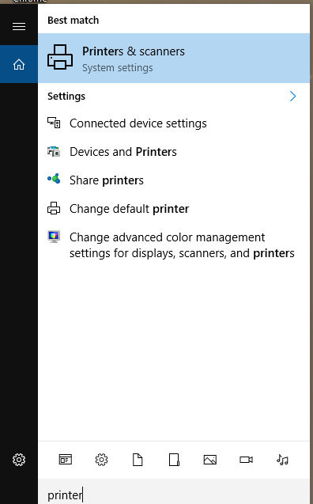
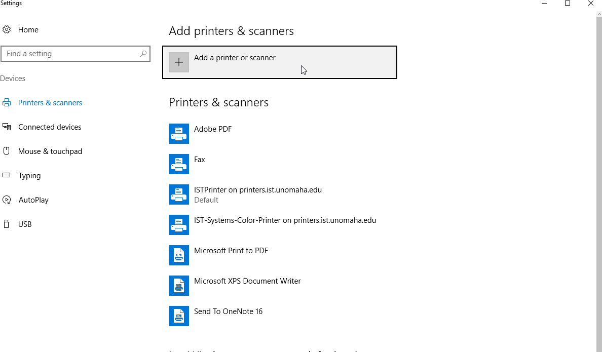
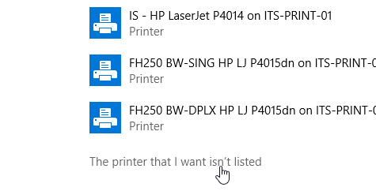
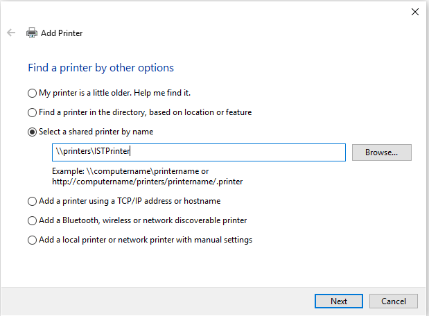
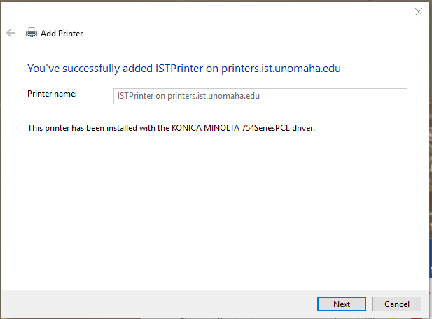

# How to add IST Printer for Windows

This guide is for Staff and Faculty on how to add the IST Printer.
Note: YOU MUST BE INSIDE THE BUILDING ON AN ETHERNET CONNECTION OR ON THE VPN WHEN USING WIFI OR FROM OFF CAMPUS FOR THIS TO WORK

### Step 1 
At the bottom left of your computer screen there is the windows logo, directly to the right of the logo there is a magnifying glass. Please select the magnifying icon. 

### Step 2 
Type the word printer. An option will appear at the type call, "Printers & Scanners". Please select this option by either double clicking or pressing enter on your keyboard. 

### Step 3
At the very top of the popup we just made appear. There is an option labeled, " Add a printer or scanner" please select this option.

A list of printers will appear, please wait a moment for the list to finish appearing. Then disregard the options that appeared and scroll to where you find an option labeled, " The Printer that I want isn't listed" select that. 

### Step 4
A new popup should appear, please select the third option called," Select a shared printer by name". This will allow you to type in the box that was greyed out before
Please type, " \\\printers.ist.unomaha.edu\ISTPrinter " into the section and press enter. 

### Step 5
As long as you have permission to use the printer this will auto add the printer your device. Click next after it is done adding the printer. It will ask if you want to print a test page, that is up to you. When your done please press finish, you have sucessfully added the printer your device.

