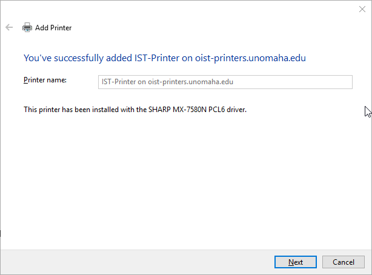

# How to add IST Printer for Windows

This guide is for Staff and Faculty on how to add the IST Printer. If you would like to see extra printing information, please follow this link: https://cist.unomaha.edu/printing  
Note: YOU MUST BE INSIDE THE BUILDING ON AN ETHERNET CONNECTION OR ON THE VPN WHEN USING WIFI OR FROM OFF CAMPUS FOR THIS TO WORK

## 4/13/2021 UPDATE: Please Delete the ISTPrinter from your device if you have it. Most machines should get it auto-installed after removing the old printer! To remove the old printer, please open "Device and Printers" (Can also be found in Control Panel), right click "ISTPrinter" and choose "Remove Device/Uninstall Device" and reboot your machine. If this doesn't work, please follow the instructions below.

## Note: You may need the Windows driver for this printer if the printer doesn't function properly after these instructions. You can find the driver by going to https://business.sharpusa.com/product-downloads. You will need to set these options: "Product Category -> MFPs" "Product -> MX-7580N" "File Type -> Drivers and Utilities". Click "Search" and this should open a new page with your options and a list of drivers that you can choose from. You will need to download "Windows 64 Bit WHQL OS Driver Package" and install that driver. A reboot may also be required.

### Step 1 
At the bottom left of your computer screen there is the windows logo and directly to the right of the logo there is a magnifying glass. Please select the magnifying icon. 

### Step 2 
Type the word printer. An option will appear called "Printers & Scanners". Please select this option by either double clicking or pressing enter on your keyboard. 

### Step 3
At the very top of the popup we just made appear. There is an option labeled, "Add a printer or scanner" please select this option.

A list of printers will appear, please wait a moment for the list to finish appearing. Disregard the options that appeared and scroll to where you find an option labeled, "The Printer that I want isn't listed" select that. 

### Step 4
A new popup should appear, please select the third option called, "Select a shared printer by name". This will allow you to type in the box that was greyed out before
Please type, " \\\oist-printers.unomaha.edu\IST-Printer " into the section and press enter. 

### Step 5
As long as you have permission to use the printer this will auto add the printer your device. Click next after it is done adding the printer. It will ask if you want to print a test page, that is up to you. When you are done, press finish. You have successfully added the printer your device.

### Notes
If this fails to connect, you can also try entering try to connect by pressing the windows key on your keyboard and the letter R at the same time, and entering the address " \\\oist-printers.unomaha.edu\ ". This should bring up a window of printers. You will need to right click on IST-Printer and click connect. If that also fails, please contact the Systems Office.

